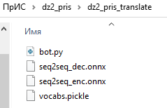
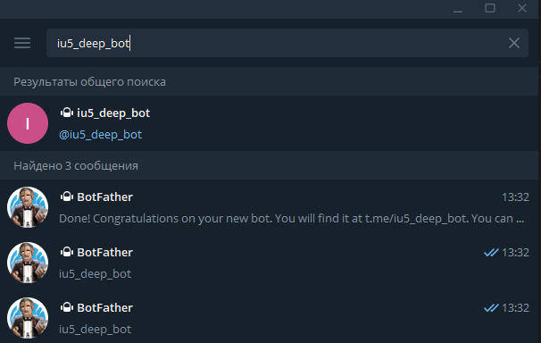
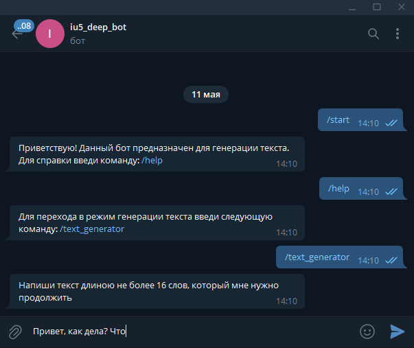

# Домашнее задание №2

## Задание

Необходимо реализовать телеграм бот на Python для генерации изображений, шумоподавления аудио, классификации LiDAR, генерации текста, машинного перевода и тд. Тему согласовать с преподавателем (запрещено использовать ДЗ-1)

- Дополнительные [материалы](https://github.com/iu5git/Deep-learning/blob/main/notebooks/homework2.ipynb) для сохранения моделей генерации текста и машинного перевода.
- [Пример](https://github.com/iu5git/Deep-learning/blob/main/notebooks/onnxPractice.ipynb) использования модели ONNX в Python. 
- [Описание](https://github.com/ugapanyuk/BKIT_2021/blob/main/pres/chatbot/bkit_telegram.pdf) создания телеграм бота.

## Контрольные вопросы
1. Архитектуры seq2seq и трансформер.
2. Предобработка текста, эмбеддинг.
3. Создание телеграм-бота с помощью telebot
4. Onnxruntime

# Пример Telegram-бота

## Часть 1
### Создание Telegram-бота
Чтобы создать бота, нам нужно дать ему название, адрес и получить токен — строку, которая будет однозначно идентифицировать нашего бота для серверов Telegram. Для этого выполними следющие шаги:

#### Шаг 1
Зайдем в Telegram под своим аккаунтом и в поиске введем имя «отца всех ботов» - BotFather. Откроем диалог с ним. ([Ссылка](https://t.me/BotFather) на чат с BotFather)

#### Шаг 2
Жмем кнопку «Запустить» (или отправим команду /start), в ответ BotFather пришлет нам список доступных команд:
+ /newbot — создать нового бота;
+ /mybots — редактировать ваших ботов;
+ /setname — сменить имя бота;
+ /setdescription — изменить описание бота;
+ /setabouttext — изменить информацию о боте;
+ /setuserpic — изменить фото аватарки бота;
+ /setcommands — изменить список команд бота;
+ /deletebot — удалить бота.

#### Шаг 3
Отправим боту команду /newbot, чтобы создать нового бота. В ответ он попросит ввести имя будущего бота. После ввода имени необходимо указать адрес бота (должен заканчиваться на слово bot, например: iu5_deep_bot).
Если адрес будет уже кем‑то занят, BotFather начнет извиняться и просить придумать какой-нибудь другой адрес.

#### Шаг 4
После указания адреса нашего бота (если он конечно же не был занят), BotFather в ответ отправит нам сообщение, в котором после фразы "Use this token to access the HTTP API" будет написана строка из букв и цифр — это и есть необходимый нам токен. (Выделен на скриншоте красным) Его следует сохранить где-нибудь, чтобы в дальнейшем указать в скрипте нашего бота.


## Часть 2
### Подготовка моделей из лабораторных работ 7 и 8
В домашнем задании №2 необходимо на выбор решить задачу генерации текста (из ЛР7) или машинного перевода (из ЛР8). Все необходимые материалы для обучения и последующего сохранения моделей в формате onnx представлены в соответствующих методических указаниях. Стоит отметить, что для задачи генерации текста помимо самой модели потребуется токенизатор (файл m.model), а для задачи машинного перевода - словарь для токенизации (файл vocabs.pickle).
## Часть 3
### Создание скрипта Telegram-бота для решения задачи генерации текста или машинного перевода
#### Шаг 1
Для начала создадим папку будущего проекта и поместим в неё все ранее полученные файлы: модель onnx и токенизатор/словарь для токенизации (финальная структура проекта с учетом следующего шага в зависимости от решаемой задачи: 1-й скриншот - генерация текста, 2-й - машинный перевод). В случае решения задачи машинного перевода моделей в формате onnx будет две.



#### Шаг 2
В этой же папке создать файл с раширением *.py* (далее файл *bot.py* - на скриншотах выше уже создан). Открыть созданный файл в любом удобном для Вас редакторе коде (при выполнении данного домашнего задания использовался *VS Code*).
#### Шаг 3
С помощью команды pip install *название библиотеки* произвести установку библиотек, указанных в строках импортирования (для библотеки *telebot* при установке использовать название *pytelegrambotapi* - пример установки на сриншоте ниже, для всех остальных - названия из импортов). 


Поместить следующий код в файл *bot.py*:

```python
import telebot
import onnxruntime
import sentencepiece as spm
import numpy as np
import pickle
import re
```

#### Шаг 4
В файл *bot.py* добавить код загрузки и открытия сессий с onnx моделями. Необходимо оставить только те модели и файлы, которые необходимы для решения выбранной задачи. Также в качестве аргумента функции *telebot.TeleBot('токен вашего бота')* указать ранее полученный от BotFather'а токен:

```python
flag = 0
#далее указывются названия используемых моделей и служебных файлов, лишнее просто закомментировать
sp = spm.SentencePieceProcessor('m.model') #для генерации текста
sess = onnxruntime.InferenceSession('Conv_next_token.onnx') #для генерации текста(1)
sess_enc = onnxruntime.InferenceSession('seq2seq_enc.onnx') #для машинного перевода
sess_dec = onnxruntime.InferenceSession('seq2seq_dec.onnx') #для машинного перевода
sess1 = onnxruntime.InferenceSession('LSTM_next_token.onnx') #для генерации текста(2)
sess2 = onnxruntime.InferenceSession('Transformer_next_token.onnx') #для генерации текста(3)
with open('vocabs.pickle', 'rb') as f: #для машинного перевода
	SRC_SOS, SRC_EOS, SRC_STOI, TRG_SOS, TRG_EOS, TRG_STOI, TRG_ITOS = pickle.load(f)
inputs = sess.get_inputs()
#ниже указать ранее сгенерированный bot_father'ом токен вашего бота
bot = telebot.TeleBot('5210324951:AAGGMJbVM_P8u9mtqJqMiee6-N7LPJcyLRg')
```

#### Шаг 5
Без изменений поместить в *bot.py* код служебных функций и функций работы с onnx моделями:

```python
def tokenize(text):
	return re.findall("[A-Z]{2,}(?![a-z])|[A-Z][a-z]+(?=[A-Z])|[\'\w\-]+",text)


def preprocess(text):
	tokens = [t.lower() for t in tokenize(text)]
	tokens = [SRC_SOS] + tokens + [SRC_EOS]
	src_indexes = [SRC_STOI.get(token, 0) for token in tokens]
	src_tensor = np.int64(src_indexes).reshape(1, -1)
	src_mask = (np.int64(src_indexes) != 1).reshape(1, 1, 1, -1)
	return src_tensor, src_mask


def get_trg_mask(trg_tensor):
	trg_pad_mask = (trg_tensor != 1).reshape(1, 1, 1, -1)
	trg_len = trg_tensor.shape[1]
	trg_sub_mask = np.tril(np.ones((trg_len, trg_len), dtype=np.bool))
	return trg_pad_mask & trg_sub_mask
```

```python
def Translate(message):

	test_text = message.text
	print(test_text)
	src_tensor, src_mask = preprocess(test_text)
	enc_src = sess_enc.run(None, {'src_tensor': src_tensor,
                              'src_mask': src_mask})[0]
	trg_indexes = [TRG_STOI[TRG_SOS]]
	for i in range(128):
		trg_tensor = np.int64(trg_indexes).reshape(1, -1)
		trg_mask = get_trg_mask(trg_tensor)
		output, attention = sess_dec.run(None, {'trg_tensor': trg_tensor, 
                                            'enc_src': enc_src,
                                            'trg_mask': trg_mask,
                                            'src_mask': src_mask})
		pred_token = output.argmax(axis=2)[:,-1].item()
		print(pred_token)
		trg_indexes.append(pred_token)
		if pred_token == TRG_STOI[TRG_EOS]:
			break

	trg_tokens = [TRG_ITOS[i] for i in trg_indexes]
	' '.join(trg_tokens[1:-1])
	result = ' '
	for i in range(len(trg_tokens[1:-1])):
		result = result + ' '+ trg_tokens[i+1]
	bot.send_message(message.from_user.id, result)


def Conv1d(message):

	try:
		inputs = sp.encode(message.text)[-16:]
		inputs = [0]*max(16 - len(inputs), 0) + inputs
		finalresult = message.text
		for i in range(10):
			token = sess.run(None, {'input.1': np.array(inputs, dtype=np.int64).reshape(1, 16)})[0]
			inputs.pop(0)
			inputs.append(int(token[-1].argmax()))
			finalresult = finalresult +' '+ sp.decode([int(token[-1].argmax())])
		bot.send_message(message.from_user.id, finalresult)
	except (onnxruntime.capi.onnxruntime_pybind11_state.InvalidArgument):
		bot.send_message(message.from_user.id, "Слишком большая последовательность или неверный аргумент")


def LSTM(message):

	inputs = sp.encode(message.text)[-16:]
	inputs = [0]*max(16 - len(inputs), 0) + inputs
	finalresult = message.text 
	for i in range(10):
		token = sess1.run(None, {'input.1': np.array(inputs, dtype=np.int64).reshape(1, 16),
                       'onnx::Slice_1': np.zeros((2, 16, 256), dtype=np.float32),
                       'onnx::Slice_2': np.zeros((2, 16, 256), dtype=np.float32)})[0]
		inputs.pop(0)
		inputs.append(int(token[-1].argmax()))
		print(sp.decode([int(token[-1].argmax())]))
		finalresult = finalresult +' '+ sp.decode([int(token[-1].argmax())])
	bot.send_message(message.from_user.id, finalresult)


def Transformer(message):
	
	inputs = sp.encode(message.text)[-16:]
	inputs = [0]*max(16 - len(inputs), 0) + inputs
	token = sess2.run(None, {'src': np.array(inputs, dtype=np.int64).reshape(1, 16)})[0]
	finalresult = message.text 
	finalresult = finalresult + sp.decode([int(tok.argmax()) for tok in token[0]])
	bot.send_message(message.from_user.id, finalresult)
```

#### Шаг 6
В зависимости от решаемой задачи в файл *bot.py* вставить либо первый, либо второй фрагмент кода (для генерации текста - первый, для машинного перевода - второй):

```python
#данный код предназначен для решения задачи генерации текста
@bot.message_handler(content_types=['text'])
def get_text_messages(message):
	global flag
	if flag == 0:
		if message.text == "/start":
			bot.send_message(message.from_user.id, "Приветствую! Данный бот предназначен для генерации текста. Для справки введи команду: /help")
		elif message.text == "/help":
			bot.send_message(message.from_user.id, "Для перехода в режим генерации текста введи следующую команду: /text_generator")
		elif message.text == "/text_generator":
			bot.send_message(message.from_user.id, "Напиши текст длиною не более 16 слов, который мне нужно продолжить")
			flag = 1
		else:
			bot.send_message(message.from_user.id, "Не понимаю, что тебе нужно. Для справки введи команду: /help")
	elif flag==1:
		#выбрать нужную модель, остальное закомментировать
		#Conv1d(message)
		#LSTM(message)
		Transformer(message)
		flag=0


bot.polling(none_stop=True, interval=0)
```

```python
#данный код предназначен для решения задачи машинного перевода
@bot.message_handler(content_types=['text'])
def get_text_messages(message):
	global flag
	if flag == 0:
		if message.text == "/start":
			bot.send_message(message.from_user.id, "Приветствую! Данный бот предназначен для машинного перевода текста. Для справки введи команду: /help")
		elif message.text == "/help":
			bot.send_message(message.from_user.id, "Для перехода в режим машинного перевода введи следующую команду: /translator")
		elif message.text == "/translator":
			bot.send_message(message.from_user.id, "Напиши текст на русском языке для перевода на английский")
			flag = 2
		else:
			bot.send_message(message.from_user.id, "Не понимаю, что тебе нужно. Для справки введи команду: /help")
	elif flag==2:
		Translate(message)
		flag=0


bot.polling(none_stop=True, interval=0)
```

#### Шаг 7
Запустить выполнение файла *bot.py*. Открыть приложение Telegram и в поиске набрать имя Вашего бота. Нажать на него и в открывшемся чате запустить диалог.





P.S. Для остановки работы Вашего телеграм бота достаточно просто прекратить выполнение файла *bot.py*.

### Полезные ссылки
1. [Стартовый гайд по ботам PyTelegramBotAPI](https://habr.com/ru/post/697052/)